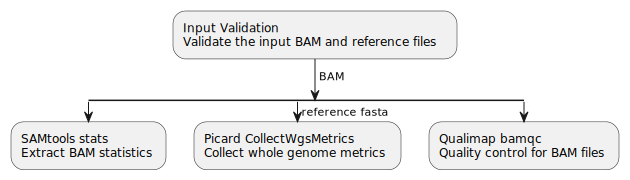

# generate-SQC-BAM

[](https://github.com/uclahs-cds/pipeline-generate-SQC-BAM/actions/workflows/prepare-release.yaml)

  1. [Overview](#overview)
  2. [How To Run](#how-to-run)
  3. [Flow Diagram](#flow-diagram)
  4. [Pipeline Steps](#pipeline-steps)
  5. [Inputs](#inputs)
  6. [Outputs](#outputs)
  7. [Discussions](#discussions)
  8. [Contributors](#contributors)
  9. [References](#references)
## Overview

This pipeline takes BAMs and runs selected Quality Control (QC) steps. Available algorithms are currently `SAMtools stats`, `Picard CollectWgsMetrics`, `Picard CollectHsMetrics`, `FastQC`, `Qualimap bamqc`, `mosdepth coverage` and `mosdepth quantize`. Generally either `Qualimap bamqc` or `SAMtools stats and Picard CollectWgsMetrics` should be run, not both. `Qualimap bamqc` uses a lot of memory and should not be run within `uclahs-cds/metapipeline-DNA`. Input can include any combination of tumor and normal BAMs from a single donor. Each will be processed independently. RNA specific QC is not yet implemented but is expected soon.

For DNA panels/targeted sequencing, intervals may be provided and will be used with `CollectHsMetrics`, `mosdepth` and `Qualimap bamQC`.  `CollectHsMetrics` requires intervals and an optional `bait` file may also be provided.

---

## How To Run

1. Update the params section of the `.config file`  ([Example config](config/template.config)).

2. Update the input YAML ([Template YAMLs](input/)).

3. See the submission script, [here](https://github.com/uclahs-cds/tool-submit-nf), to submit your pipeline

### Requirements
Currently supported Nextflow versions: `v23.04.2`

---

## Flow Diagram



---

## Pipeline Steps
Each of the below algorithms, if selected, will run in parallel subject to available resources.

### 1. SAMtools stats
[samtools stats](https://www.htslib.org/doc/samtools-stats.html) collects basic statistics from BAM files including read counts, qualities, GC content, insert sizes, read lengths, proper pairing, and duplicated bases.

### 2. Picard CollectWgsMetrics
[picard CollectWgsMetrics](https://gatk.broadinstitute.org/hc/en-us/articles/4414602403355-CollectWgsMetrics-Picard) collects coverage metrics from WGS BAM files.

### 3. Picard CollectHsMetrics
[picard CollectHsMetrics](https://gatk.broadinstitute.org/hc/en-us/articles/360036856051-CollectHsMetrics-Picard) collects coverage metrics from WGS BAM files.

### 4. Qualimap bamqc
[qualimap bamqc](http://qualimap.conesalab.org/doc_html/analysis.html#bam-qc) collects basic statistics and coverage metrics from BAM files. Example output: [html](https://kokonech.github.io/qualimap/HG00096.chr20_bamqc/qualimapReport.html) [pdf](https://kokonech.github.io/qualimap/ERR089819_report.pdf). `Qualimap bamqc` uses a lot of memory and should not be run within `uclahs-cds/metapipeline-DNA`.

### 5. mosdepth coverage or quantize
[mosdepth](https://github.com/brentp/mosdepth) `coverage` by windows provides fast BAM/CRAM depth calculation, reported by windows. `quantize` creates a bed file labeling regions within specified coverage thresholds. Similar to GATK's callable loci tool.

### 6. FastQC
[FastQC](https://www.bioinformatics.babraham.ac.uk/projects/fastqc/Help/) aims to provide a QC report which can spot problems which originate either in the sequencer or in the starting library material.

---

## Inputs

### Input YAML

 Example:
```yaml
---
patient_id: 'patient_id'
dataset_id: 'dataset_id'
input:
  normal:
    - path: /absolute/path/to/normal.bam
      read_length: length
  tumor:
    - path: /absolute/path/to/tumor.bam
      read_length: length
```

### Config

| Field | Type | Required | Description |
| ----- | ---- | ------------ | ------------------------ |
| `algorithm` | list | no | List of tools to be run: ['fastqc', 'samtools_stats', 'collectwgsmetrics', 'collecthsmetrics', 'mosdepth_coverage', 'mosdepth_quantize', 'qualimap_bamqc'], default = ['stats', 'collectwgsmetrics'] |
| `reference` | path | yes/no | Reference fasta is required only for `CollectWgsMetrics` and `CollectHsMetrics` |
| `intervals_bed` | path | no | Absolute path to BED file with intervals to process |
| `output_dir` | path | yes | Not required if `blcds_registered_dataset` = `true` |
| `blcds_registered_dataset` | boolean | no | Default is `false`. Only `uclahs_cds` users should change this. When `true`, BLCDS folder structure is used |
| `work_dir` | path | no | Path of working directory for Nextflow. When included, Nextflow intermediate files and logs will be saved to this directory. With `uclahs_cds` = `true`, the default is `/scratch` and should only be changed for testing/development. Changing this directory to `/hot` or `/tmp` can lead to high server latency and potential disk space limitations, respectively. |

#### SAMtools specific configuration
| Field | Type | Required | Description |
| ----- | ---- | ------------ | ------------------------ |
| stats_max_rgs_per_sample | integer | no | If a sample has more than this number of readgroups, `SAMtools stats` will not run per readgroup analysis. Default = 20 |
| stats_max_libs_per_sample | integer | no | If a sample has more than this number of libraries, `SAMtools stats` will not run per library analysis. Default = 20 |
| stats_remove_duplicates | boolean | no | Ignore reads marked as duplicate. Default = `false` |
| stats_additional_options | string | no | Any additional options recognized by `samtools stats` |

#### Picard CollectWgsMetrics specific configuration
| Field | Type | Required | Description |
| ----- | ---- | ------------ | ------------------------ |
| cwm_coverage_cap | integer | no | Cap coverage at this value. Default = 250 |
| cwm_minimum_mapping_quality | integer | no | Ignore reads with mapping quality below this value. Default = 20 |
| cwm_minimum_base_quality | integer | no | Ignore bases with quality below this value. Default = 20 |
| cwm_use_fast_algorithm | boolean | no | If `true`, fast algorithm is used |
| cwm_additional_options | string | no | Any additional options recognized by `CollectWgsMetrics` |

#### Picard CollectHsMetrics specific configuration
| Field | Type | Required | Description |
| ----- | ---- | ------------ | ------------------------ |
| chm_bait_intervals_bed | path | no| if not defined, `intervals_bed` will be used |
| chm_coverage_cap | integer | no | Cap coverage at this value. Default = 250 |
| chm_minimum_mapping_quality | integer | no | Ignore reads with mapping quality below this value. Default = 20 |
| chm_minimum_base_quality | integer | no | Ignore bases with quality below this value. Default = 20 |
| chm_per_base_output | boolean | no | Default = `false` |
| chm_additional_options | string | no | Any additional options recognized by `CollectWgsMetrics` |

#### FastQC specific configuration
| Field | Type | Required | Description |
| ----- | ---- | ------------ | ------------------------ |
| fastqc_level | string | yes | 'readgroup', 'library' or 'sample' |
| fastqc_additional_options | string | no | Any additional options recognized by `FastQC` |

#### Qualimap specific configuration
| Field | Type | Required | Description |
| ----- | ---- | ------------ | ------------------------ |
| bamqc_output_format | string | no | Choice of 'pdf' or 'html', default = 'html'. `html` is needed for `multiqc` |
| bamqc_additional_options | string | no | Any additional options recognized by `bamqc` |

#### mosdepth window-based coverage specific configuration
| Field | Type | Required | Description |
| ----- | ---- | ------------ | ------------------------ |
| mosdepth_windows | integer | no | Size for `mosdepth windows` coverage calculations. Not used if `intervals_bed` is defined. Default = 500 |
| mosdepth_use_fast_algorithm | boolean | no | `fast` algorithm ignores read pair overlaps and CIGARs. It should not be used on libraries with small insert sizes. Default = `false` |
| mosdepth_per_base_output | boolean | no | Output coverage for every base. Default = `true` |
| mosdepth_additional_options | string | no | Any additional options recognized by `mosdepth`, `--mapq 20 recommended` |

#### mosdepth quantize specific configuration
| Field | Type | Required | Description |
| ----- | ---- | ------------ | ------------------------ |
| mosdepth_quantize_cutoffs | string | no | cutoffs for coverage regions. Default = `0:1:5:150` |
| mosdepth_quantize_use_fast_algorithm | boolean | no | `fast` algorithm ignores read pair overlaps and CIGARs. It should not be used on libraries with small insert sizes. Default = `false` |
| mosdepth_q0_label | string | no | lowest coverage regions label. Default = `Q0`
| mosdepth_q1_label | string | no | next coverage regions label. Default = `Q1`
| mosdepth_q2_label | string | no | next coverage regions label. Default = `Q2`
| mosdepth_q3_label | string | no | highest coverage regions label. Default = `Q3`
| mosdepth_quantize_additional_options | string | no | Any additional options recognized by `mosdepth`. `--mapq 20 recommended` |

#### Base resource allocation updaters
To update the base resource (cpus or memory) allocations for processes, use the following structure. The default allocations can be found in the [node-specific config files](./config/)
```Nextflow
base_resource_update {
    memory = [
        [['process_name', 'process_name2'], <multiplier for resource>],
        [['process_name3', 'process_name4'], <different multiplier for resource>]
    ]
    cpus = [
        [['process_name', 'process_name2'], <multiplier for resource>],
        [['process_name3', 'process_name4'], <different multiplier for resource>]
    ]
}
```
> **Note** Resource updates will be applied in the order they're provided so if a process is included twice in the memory list, it will be updated twice in the order it's given.

Examples:

- To double memory of all processes:
```Nextflow
base_resource_update {
    memory = [
        [[], 2]
    ]
}
```
- To double memory for `run_CollectWgsMetrics_Picard` and triple memory for `run_statsSamples_SAMtools` and `run_bamqc_Qualimap`:
```Nextflow
base_resource_update {
    memory = [
        ['run_CollectWgsMetrics_Picard', 2],
        [['run_statsSamples_SAMtools', 'run_bamqc_Qualimap'], 3]
    ]
}
```
- To double CPUs and memory for `run_CollectWgsMetrics_Picard` and double memory for `run_statsSamples_SAMtools`:
```Nextflow
base_resource_update {
    cpus = [
        ['run_CollectWgsMetrics_Picard', 2]
    ]
    memory = [
        [['run_CollectWgsMetrics_Picard', 'run_statsSamples_SAMtools'], 2]
    ]
}
```
---

## Outputs

| Output | Description |
| ------------ | ------------------------ |
| `{SAMtools-version}_{dataset_id}_{sample_id}_stats.txt` | `SAMtools stats` sample level results |
| `{SAMtools-version}_{dataset_id}_{sample_id}-{library_id}_stats.txt` | `SAMtools stats` library level results |
| `{SAMtools-version}_{dataset_id}_{sample_id}-{library_id}-{rg_id}_stats.txt` | `SAMtools stats` readgroup level results |
| `{Picard-version}_{dataset_id}_{sample_id}_wgs-metrics.txt` | `Picard CollectWgsMetrics` results |
| `{Picard-version}_{dataset_id}_{sample_id}_hs-metrics.txt` | `Picard CollectHsMetrics` results |
| `{Qualimap-version}_{dataset_id}_{sample_id}_stats` | Directory of `Qualimap` results, including, `genome_results.txt` and either `.pdf` or `.html and supporting directories`|
| `{FastQC-version}_{dataset_id}_{sample_id}_fastqc` | Directory of sample level `FastQC` results |
| `{FastQC-version}_{dataset_id}_{sample_id}-{library_id}_fastqc` | Directory of library level `FastQC` results |
| `{FastQC-version}_{dataset_id}_{sample_id}-{library_id}-{rg_id}_fastqc` | Directory of readgroup level `FastQC` results |
| `{mosdepth-version}_{dataset_id}_{sample_id}-{window_size}.mosdepth.summary.txt` | `mosdepth` coverage results by region with a final line for `total` |
| `{mosdepth-version}_{dataset_id}_{sample_id}-{window_size}.mosdepth.global.dist.txt` | `mosdepth` coverage cumulative distribution indicating the proportion of total bases that were covered for at least a given coverage value |
| `{mosdepth-version}_{dataset_id}_{sample_id}-{window_size}.mosdepth.region.dist.txt` | `mosdepth` coverage cumulative distribution indicating the proportion of the windows that were covered for at least a given coverage value |
| `{mosdepth-version}_{dataset_id}_{sample_id}-{window_size}.regions.bed.gz` | `mosdepth` coverage bedfile giving coverage for each window |
| `{mosdepth-version}_{dataset_id}_{sample_id}-quantize-{q0}-{q1}-{q2}-{q3}.mosdepth.summary.txt` | `mosdepth` quantize coverage results by region with a final line for `total` |
| `{mosdepth-version}_{dataset_id}_{sample_id}-quantize-{q0}-{q1}-{q2}-{q3}.mosdepth.global.dist.txt` | `mosdepth` quantize cumulative distribution indicating the proportion of total bases that were covered for at least a given coverage value |
| `{mosdepth-version}_{dataset_id}_{sample_id}-quantize-{q0}-{q1}-{q2}-{q3}.quantized.bed.gz` | `mosdepth` quantize bed file |

---

## References

1. [SAMtools stats](https://www.htslib.org/doc/samtools-stats.html)
2. [Picard CollectWgsMetrics](https://gatk.broadinstitute.org/hc/en-us/articles/4414602403355-CollectWgsMetrics-Picard)
3. [Qualimap bamqc](http://qualimap.conesalab.org/doc_html/analysis.html#bam-qc)
4. [FastQC](http://www.bioinformatics.babraham.ac.uk/projects/fastqc/)
5. [mosdepth](https://doi.org/10.1093/bioinformatics/btx699)

---

## Discussions

- [Issue Tracker](https://github.com/uclahs-cds/pipeline-generate-SQC-BAM/issues) to report errors and enhancement ideas.
- Discussions can take place in [generate-SQC-BAM Discussions](https://github.com/uclahs-cds/pipeline-generate-SQC-BAM/discussions)
- [generate-SQC-BAM Pull Requests](https://github.com/uclahs-cds/pipeline-generate-SQC-BAM/pulls) are also open for discussion

---

## Contributors

Please see list of [Contributors](https://github.com/uclahs-cds/pipeline-generate-SQC-BAM/graphs/contributors) at GitHub.

---

## License

Generate-SQC-BAM is licensed under the GNU General Public License version 2. See the file LICENSE for the terms of the GNU GPL license.

Generate-SQC-BAM takes BAM files and generates per sample QC metrics

Copyright (C) 2024 University of California Los Angeles ("Boutros Lab") All rights reserved.

This program is free software; you can redistribute it and/or modify it under the terms of the GNU General Public License as published by the Free Software Foundation; either version 2 of the License, or (at your option) any later version.

This program is distributed in the hope that it will be useful, but WITHOUT ANY WARRANTY; without even the implied warranty of MERCHANTABILITY or FITNESS FOR A PARTICULAR PURPOSE. See the GNU General Public License for more details.
